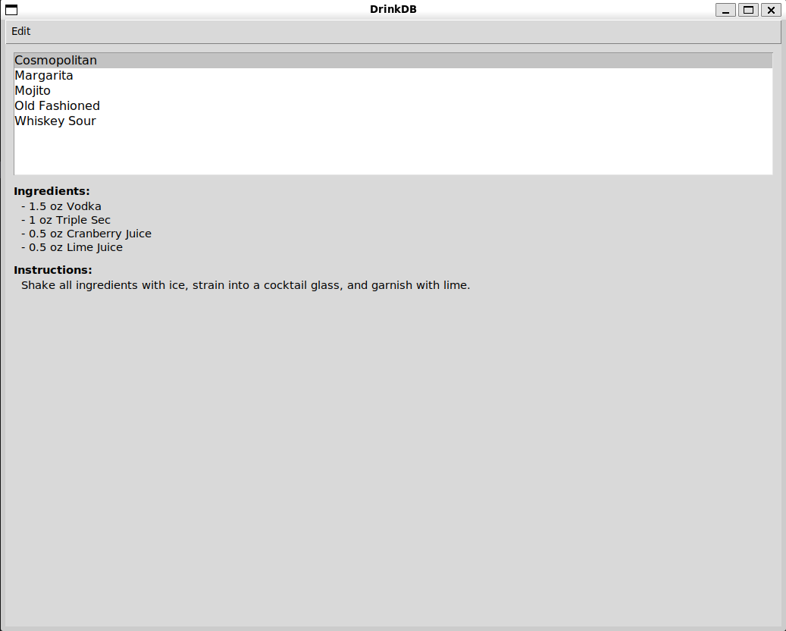

# DrinkDB

DrinkDB is a small Python application for storing the recipes of some of the most common and your favorite cocktails.


## Installation

1.) Install Python
```
MacOS

brew install python
```

```
Linux (Debian/Ubuntu)

sudo apt install python3
```

2.) Install Tkinter 
```
MacOS

brew install tcl-tk
```

```
Linux (Debian/Ubuntu)
sudo apt-get install python3-tk (Debian/Ubuntu)
```

3.) Clone repository to your local machine

4.) To execute the application navigate to the drinkdb root directory and execute the following command
```
python3 main.py
```
## Known Issues
- Pulling the main branch after cloning has the potential to overwrite your saved cocktails. I am currently working on a way to backup or merge the lists to prevent the loss of user defined data.